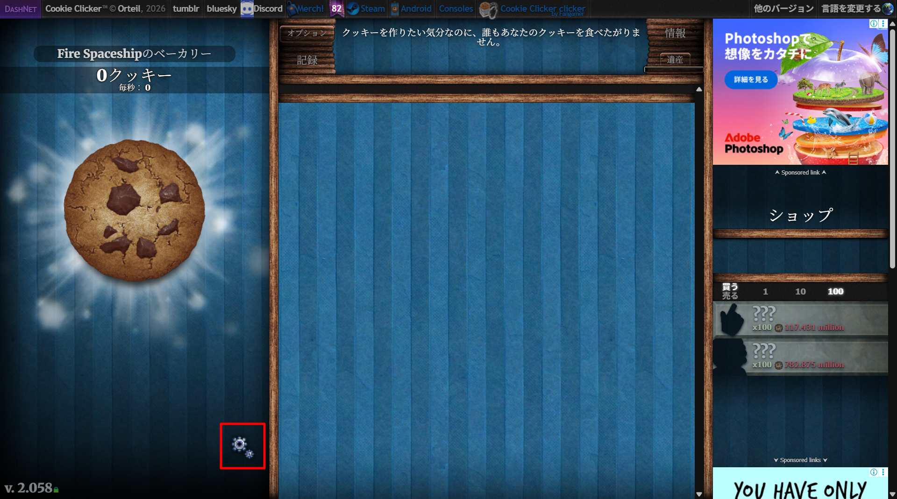
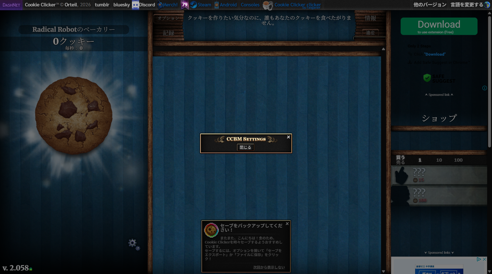

# CookieClickerBasicMOD (CCBM)

* [導入方法](#導入方法)
* [使い方](#使い方)
* [収録MOD一覧](#収録mod一覧)
* [FAQ](#faq)
* [サポート・連絡先](#サポート連絡先)
* [更新履歴](#更新履歴)

### Latest Version : `v.1.1.0` (CCBM)
※各MODのバージョン情報は[収録MOD一覧](#収録mod一覧)をご覧ください。

---

### [Discord](https://discord.com/invite/PYQr6WN9a3)見てね！！！！

**CookieClickerBasicMod (CCBM)** は、ブラウザ版[CookieClicker](https://orteil.dashnet.org/cookieclicker/)に便利な機能を追加する非公式MODです。

UserScriptの「Loader」をインストールするだけで、さまざまなMODを統合管理し、手作業で更新する必要なく、常に最新の状態で利用できます。

※Loaderの更新を手動で行う必要がある場合があります。

※本MODは**非公式**です。Orteil及びオリジナルのCookieClickerとは一切関係ありません。

※Steam版には対応しておりません。

※ライセンスについては [LICENSE](LICENSE) をご確認ください。

© 2026 tybob8010(ぼぶ)

---

## 📥導入方法
TampermonkeyなどのUserScript拡張機能を利用して、MODを起動させます。

### 1. 拡張機能をインストールする
お使いのブラウザに合わせて Tampermonkey をインストールしてください。
* [Chrome / EdgeなどChromium系統のブラウザ](https://chromewebstore.google.com/detail/tampermonkey/dhdgffkkebhmkfjojejmpbldmpobfkfo?hl=ja)
* [Firefox](https://addons.mozilla.org/en-US/firefox/addon/tampermonkey/)

### 2. Loader をインストールする
以下のリンクをクリックして、各MODを管理するUserScriptをインストールします。
* [Loader をインストールする](https://tybob8010.github.io/CCBM/loader.user.js)

### 3. 「インストール」をクリック
Tampermonkeyの確認画面が表示されるので、「インストール」ボタンを押してください。

### 4. 実際にMODが起動しているか確認
CookieClickerのページに移動して実際にMODが起動しているか確認してください。以下のようにTampermonkeyのアイコンの右下に数字が表示されていれば、UserScriptが動き、MODが起動しています。

もし起動していない場合は[FAQ](#faq)をご覧ください。

### 困った場合は[FAQ](#faq)をご覧ください。

---

## 📜使い方
1. ゲーム画面左側に表示される**歯車アイコン**をクリックします。

2. 設定したいMODの項目を設定します。

* それぞれMOD名の右側にある「無効化」を押すと、MODを無効化できます。また、「有効化」を押すことで再度MODを有効化できます。

---

## 📦収録MOD一覧
現在、以下のMODが自動的に読み込まれます。

| MOD名 | 略称 | Latest Version | 機能概要 |　詳細 |
| :--- | :--- | :--- | :--- | :--- |
| CookieClickerBasicMOD | CCBM | `v.1.1.0` | 歯車アイコンを表示し、各MODの設定を統合管理します。 | --- |
| CookieClickerAutoClosingMOD | CCACM | `v.1.1.1` | 指定した時刻に自動でセーブを行い、タブを閉じます。 | [こちら](/CCACM/README.md) |
| CookieClickerCloudSaveMOD | CCCSM | `v.1.0.0` | webhook機能を使い、一定時間ごとにDiscordにセーブデータの.txtファイルを送信します。 |　[こちら](/CCCSM/README.md) |

---

## 💡FAQ
### Q.Tampermonkeyが起動していません。
> **`A.`** お使いのブラウザの「拡張機能の管理」等からTampermonkeyの詳細設定を開き、「ユーザースクリプトを許可する」と「ファイルのURLへのアクセスを許可する」を有効にしてください。その後CookieClickcerを再読み込みしてください。

### Q.Tampermonkeyは起動しているのですが、歯車アイコンが表示されません。
> **`A.`** MOD導入時にすでにCookieClickerを開いている場合は、インストール後にページを再読み込み（F5キー、Ctrl+R等）してください。Tampermonkeyの右下に数字が表示されているか（画像参照）、画面左側に歯車アイコンが表示されればMOD読み込みは成功です。

### Q.歯車アイコンを押しても設定ウィンドウにMOD一覧が表示されません
> **`A.`** アップデート等によりCCBMまたはその他MODに変更がなされると、古いキャッシュにより設定ウィンドウが更新されない場合があります（図参照）。その際は、必ずセーブデータを保存したのち「Ctrl+F5」か「Ctrl+Shift+R」をしてゲーム自体を再読み込みください。

---

## 💬サポート・連絡先
不明点、要望、バグ報告は [Discord](https://discord.com/invite/PYQr6WN9a3) までお寄せください。

---

## 📝更新履歴
### v.1.1.0

*2026/04/08公開*

**CCACM修正と構造改善**
* **CCACM**: CCACMの本来の機能であるタブを閉じる動作が行われない問題を改善しました。
* **CCBMとloaderの構造改善**: 今後新たなMOD開発を見据えてCCBMとLoaderの構造を変更しました。
* **README一部追記**: [使い方](#使い方)等を更新しました。

### v.1.0.0

*2026/03/26公開*

**CCBM正式リリース**
* **CCACM実装**: [CCACM](/CCACM/README.md)をCCBMから起動できるようにしました。

### v.1.0.0β

*2026/03/21公開*

**CCBMリリース**
* **システム統合**: 各MODを個別にインストールする必要がなくなりました。
* **CCBM実装**: 設定画面を一つの歯車アイコンに集約しました。
* **自動更新対応**: 今後はGitHub上の更新が自動的にユーザー環境へ反映されます。