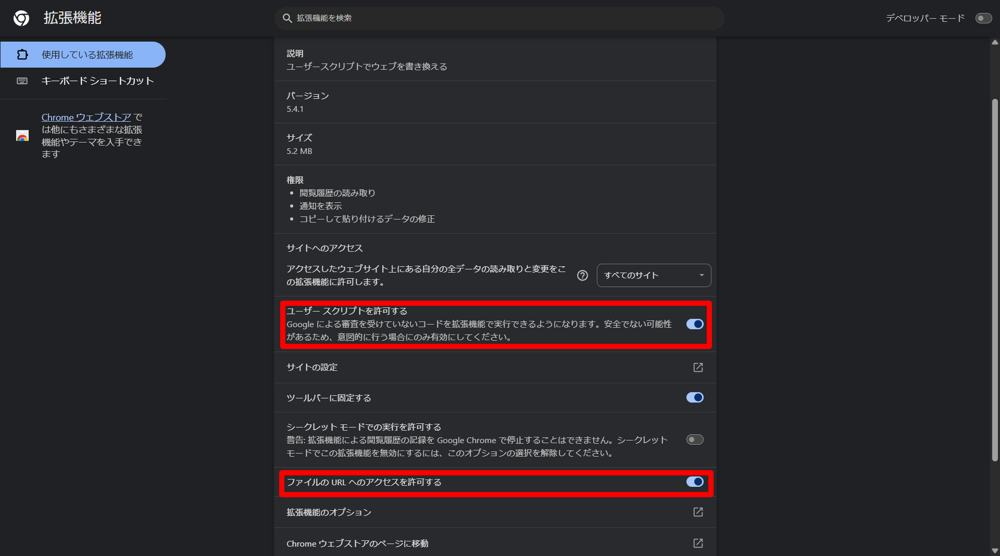

# CookieClickerBasicMOD (CCBM)

### Latest Version : `v.1.0.0` (Loader)
※各MODのバージョン情報は[収録MOD一覧](#収録mod一覧)をご覧ください。

---

**CookieClickerBasicMod (CCBM)** は、ブラウザ版[CookieClicker](https://orteil.dashnet.org/cookieclicker/)に便利な機能を追加する非公式MODです。

UserScriptの「Loader」をインストールするだけで、さまざまなMODを統合管理し、手作業で更新する必要なく、常に最新の状態で利用できます。

※本MODは**非公式**です。

※Steam版には対応しておりません。

※ライセンスについては [LICENSE](LICENSE) をご確認ください。

© 2026 tybob8010(ぼぶ)

---

## 📥導入方法
TampermonkeyなどのUserScript拡張機能を利用して、MODを起動させます。

### 1. 拡張機能をインストールする
お使いのブラウザに合わせて Tampermonkey をインストールしてください。
* [Chrome / EdgeなどChromium系統のブラウザ](https://chromewebstore.google.com/detail/tampermonkey/dhdgffkkebhmkfjojejmpbldmpobfkfo?hl=ja)
* [Firefox](https://addons.mozilla.org/en-US/firefox/addon/tampermonkey/)

### 2. Auto Loader をインストールする
以下のリンクをクリックして、各MODを管理するUserScriptをインストールします。
* [Loader をインストールする](https://tybob8010.github.io/CCBM/loader.user.js)

### 3. 「インストール」をクリック
Tampermonkeyの確認画面が表示されるので、「インストール」ボタンを押してください。

### 4. 実際にMODが起動しているか確認
CookieClickerのページに移動して実際にMODが起動しているか確認してください。以下のようにTampermonkeyのアイコンの右下に数字が表示されていれば、UserScriptが動き、MODが起動しています。

もし起動していない場合は[FAQ](#faq)をご覧ください。

### 困った場合は[FAQ](#faq)をご覧ください。

---

## 📜使い方
1. ゲーム画面左側に表示される**歯車アイコン**をクリックします。
2. 統合設定メニューが開くので、設定したいMOD（例：自動終了設定）を選択します。
3. 各MOD専用のウィンドウで設定を行い、「保存」を押せば完了です。

---

## 📦収録MOD一覧
現在、以下のMODが自動的に読み込まれます。

| MOD名 | 略称 | Latest Version | 機能概要 |
| :--- | :--- | :--- | :--- |
| CookieClickerBasicMOD | CCBM | `v.1.0.0` | 歯車アイコンを表示し、各MODの設定を統合管理します。 |
| CookieClickerAutoClosingMOD | CCACM | `v.1.1.0` | 指定した時刻に自動でセーブを行い、タブを閉じます。 |

---

## 💡FAQ
### Q.Tampermonkeyが起動していません。
> **`A.`** お使いのブラウザの「拡張機能の管理」等からTampermonkeyの詳細設定を開き、「ユーザースクリプトを許可する」と「ファイルのURLへのアクセスを許可する」を有効にしてください。その後CookieClickcerを再読み込みしてください。

### Q.Tampermonkeyは起動しているのですが、歯車アイコンが表示されません。
> **`A.`** MOD導入時にすでにCookieClickerを開いている場合は、インストール後にページを再読み込み（F5キー、Ctrl+R等）してください。Tampermonkeyの右下に数字が表示されているか（画像参照）、画面左側に歯車アイコンが表示されればMOD読み込みは成功です。

---

## 💬サポート・連絡先
不明点、要望、バグ報告は [Discord](https://discord.com/invite/PYQr6WN9a3) までお寄せください。

---

## 📝更新履歴
### v.1.0.0

*2026/03/21公開*

**CCBMリリース**
* **システム統合**: 各MODを個別にインストールする必要がなくなりました。
* **CCBM実装**: 設定画面を一つの歯車アイコンに集約しました。
* **自動更新対応**: 今後はGitHub上の更新が自動的にユーザー環境へ反映されます。